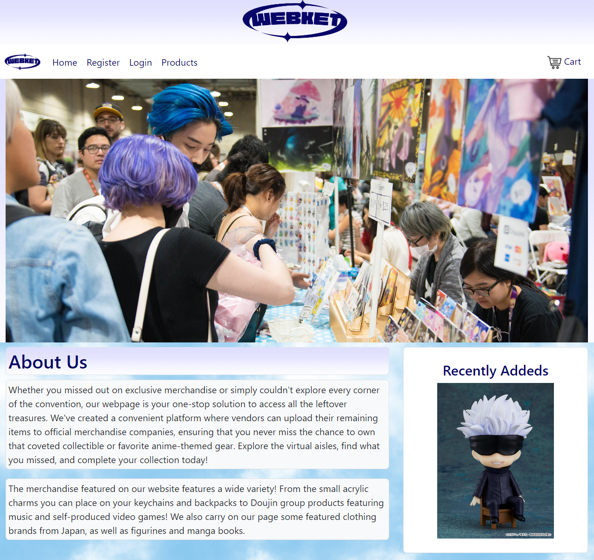
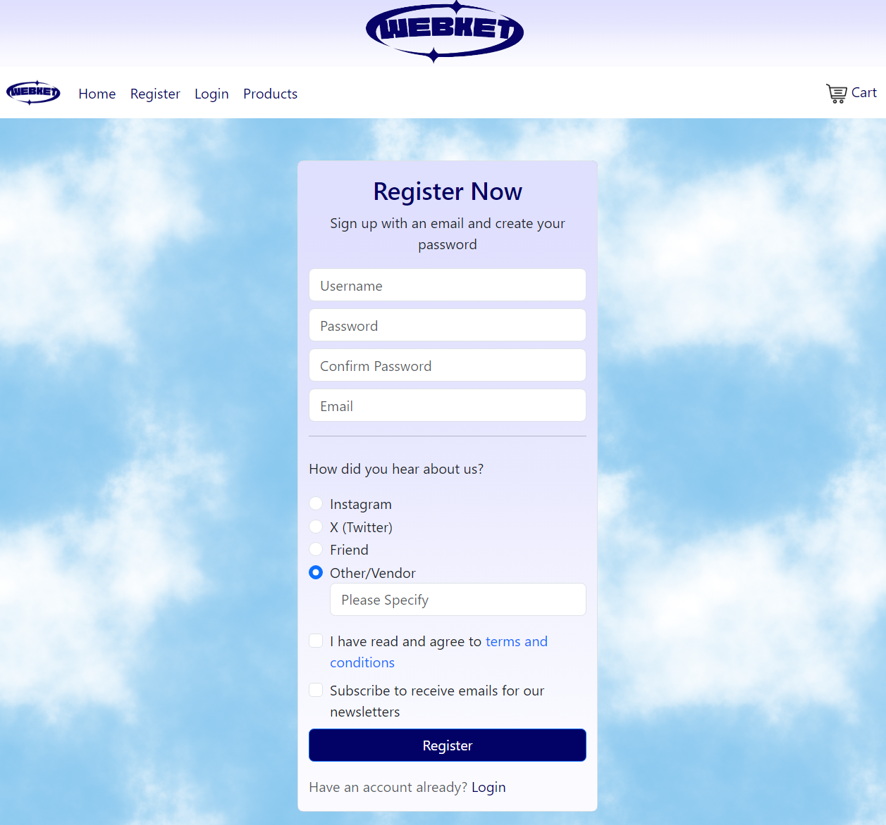
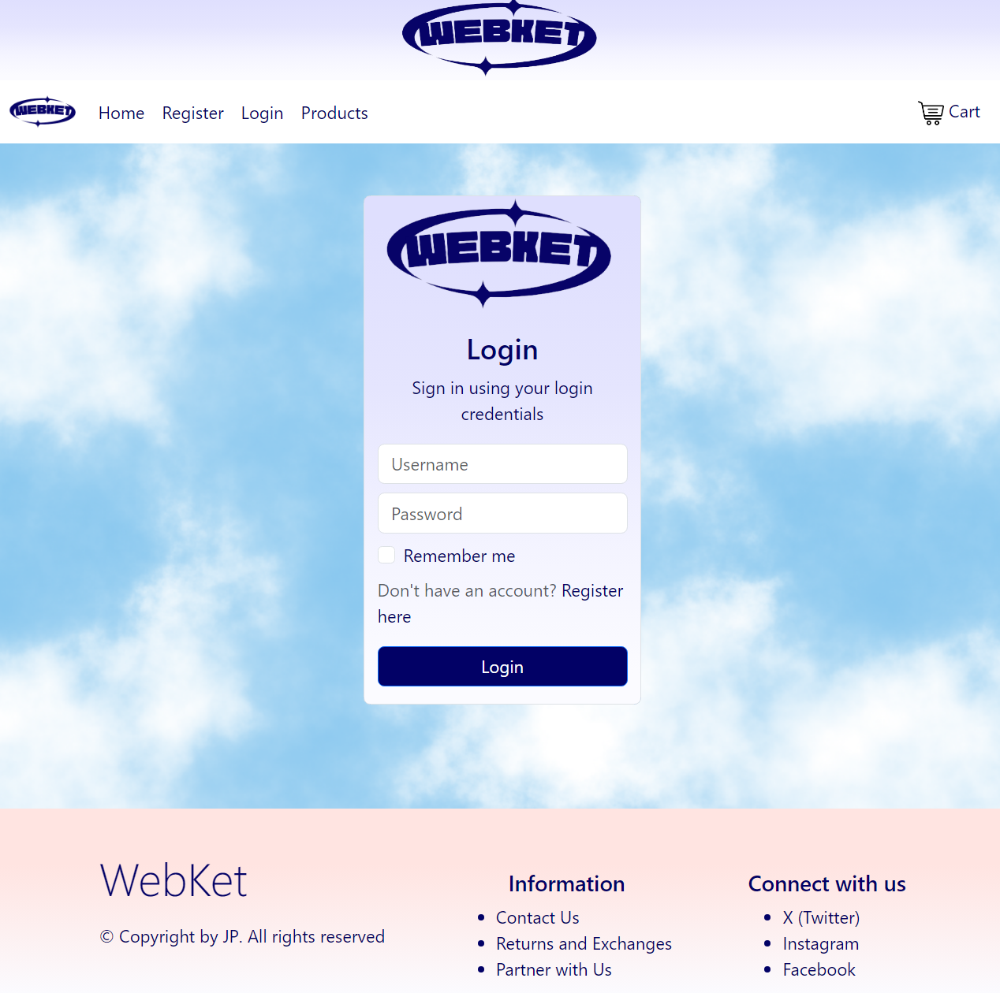
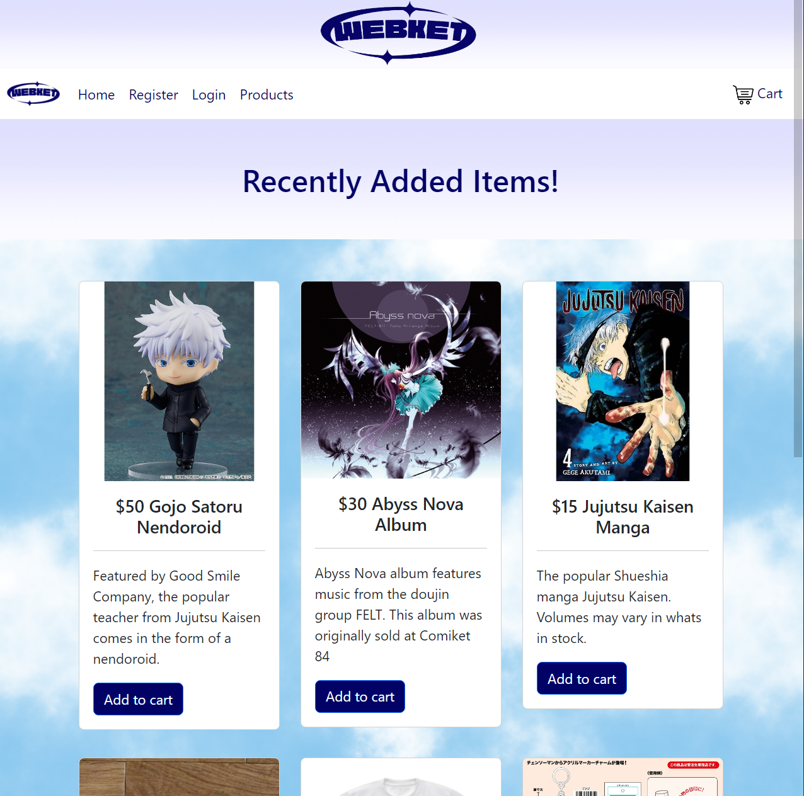
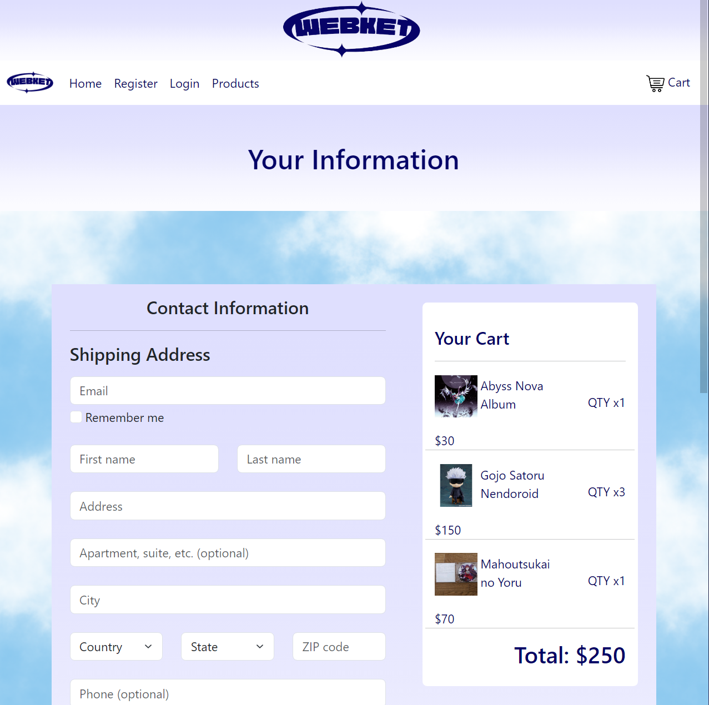

# CapstoneProject1 Ecommerce Website with HTML, CSS and Bootstrap

## A website that displays basic pages and layout for an e-commerce store, it lacks Javascript so it is not fully functional.

This project is built on the idea of making a place where multiple "vendors" or artists who produce their own products and put them up for sale by signing up and uploading themselves. Although I listed some official store products in here as filler, but my main goal is to create something that can eventually be used as something like a third party to connect vendors to customers. This project showcases:

* Displays a homepage that features what the store's purpose is for
* Features a Login and Registration page that uses HTML validation for the forms
* Features a product page to display different items that are up for sale using Bootstrap's card features
* Has an example checkout page with an order summary

## Sample images of each page

The following below are previews of each page

### Home Page

### Registration Page

### Login Page

### Products Page

### Cart Page

## An interesting piece of HTML

Although the website was made with basic HTML, CSS, and Bootstrap knowledge, there is not much to showcase. One thing that I did have fun working on was the checkout page where I had to create sample items in a "cart". What I did was that I created a class using "card-body" and utilized rows and columns to create an image of a cart with three different items even though it was only contained in one card-body. I thought it was one of the more interesting things to make because it was what I had most difficulty with. In the future I would like to learn how to properly make it so that the sample items are actually their own item, that way I could add functionality to it.